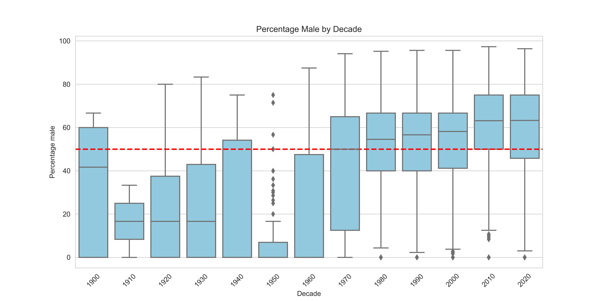

## Abstract
This investigation uses biodiversity data cubes, derived from the extensive datasets of the Global Biodiversity Information Facility (GBIF), to conduct a detailed analysis of sex ratios within ducks across Europe. Encompassing over ???? million occurrences extracted from nearly ???? datasets, this study elucidates sex distribution patterns across various species, focussing on temporal and spatial dynamics. Through the strategic exclusion of the `dwc:individualCount` from our analysis to simplify the initial approach, we aim to provide a foundational understanding of sex ratio variations and how they could be use to monitor population status and trends of biodiversity.

## Introduction
The balance of sex ratios in animal populations is a critical indicator of ecological health and evolutionary dynamics. Alterations in these ratios can reflect environmental stresses, reproductive strategies, or human influence. However, a significant challenge in accurately assessing these ratios stems from the differential detectability of males and females in many species. Factors such as behavioural differences, sexual dimorphism, and varying habitat preferences can substantially influence the likelihood of observing and recording individuals of each sex. This variability in detectability complicates the interpretation of raw sex ratio data, potentially skewing our understanding of population dynamics. The advent of biodiversity data cubes, particularly those derived from GBIF's comprehensive datasets, offers an innovative avenue to explore these biological phenomena. By aggregating vast amounts of occurrence data, these cubes allow for the application of sophisticated analytical techniques to address the issue of differential detectability. This study leverages such a data cube to examine sex ratio dynamics within the European fauna, aiming to uncover patterns that could inform conservation efforts and ecological understanding, while carefully considering the implications of detectability differences on our analyses.

## Materials and Methods
Our analytical framework is predicated on a selective extraction from the GBIF dataset, focusing on records designated as "PRESENT" while excluding data compromised by spatial inaccuracies. The analysis was facilitated by Python’s scientific stack, including pandas for data manipulation, Matplotlib and seaborn for visualisation, and GeoPandas with Shapely for spatial analysis. This study processes the derived biodiversity data cube, augmenting it with necessary spatial and temporal attributes, and preparing it for analysis.

## Results
The application of geospatial and temporal analytical techniques has unveiled significant insights into the sex ratio distribution across the European continent. Visualisation of male and female counts over decades has revealed discernible patterns and anomalies, indicating both temporal fluctuations and spatial variations. This detailed exploration provides a nuanced understanding of sex ratio dynamics, showcasing the areas and times of notable deviations.

Taking the mallard as an example a timeseries of male to female ratio has been produced.

 

## Discussion
The findings from this study highlight the intricate relationship between sex ratios and environmental, biological, and anthropogenic factors. The use of biodiversity data cubes derived from GBIF data represents a novel approach to biodiversity studies, allowing for large-scale analysis that was previously unattainable. This research not only contributes valuable insights into sex ratio analysis but also demonstrates the potential of biodiversity data cubes in advancing ecological and conservation science.

## Conclusion
This study underscores the importance of biodiversity data cubes in facilitating large-scale analyses of ecological phenomena. By exploring sex ratio variations within European animal populations, this research contributes to the broader understanding of biodiversity patterns and their underlying mechanisms. The insights derived from this analysis advocate for the continued development and utilisation of biodiversity data cubes, highlighting their significance in ecological research and conservation strategies.

## Acknowledgements
We extend our gratitude to the Global Biodiversity Information Facility (GBIF) for providing the data that formed the basis of this research, and to the myriad contributors whose efforts in data collection and curation have enriched the GBIF repository.

## References
