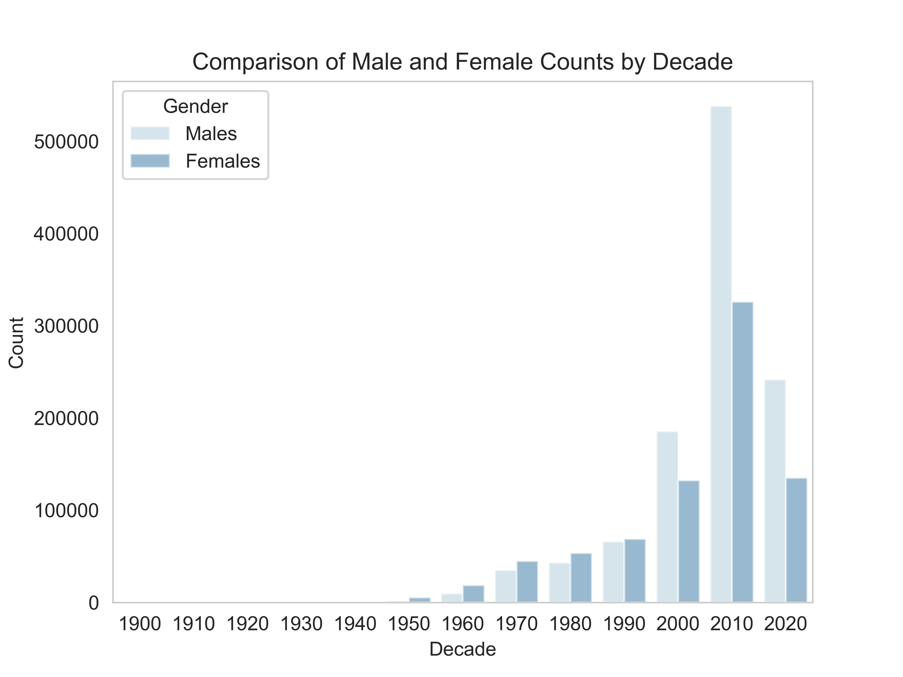

## Abstract
This investigation uses biodiversity data cubes derived from the datasets mobilised by the Global Biodiversity Information Facility (GBIF), to conduct an analysis of sex ratios of ducks across Europe. Encompassing over 4 million occurrences extracted from nearly 5000 datasets, this study elucidates sex distribution patterns across various species, focussing on temporal and spatial dynamics. The aim of this study is to highlight the availability of open sex data and its potential usefulness in research and monitoring of sex ratios of wild organisms, particularly in sexual dimorphic species.

## Introduction
The balance of sex ratios in animal populations is a critical indicator of ecological health and evolutionary dynamics [@10.1134/S2079086421030099]. Alterations in these ratios can reflect environmental stresses, reproductive strategies, or human influence. Biodiversity data cubes, particularly those derived from the diverse data mobilised by GBIF, provide a pathway to investigate various biological phenomena. Although these data may be generated by a wide array of methods, introducing a degree of heterogeneity not found in more focused surveys, they enable analysis across broader temporal and spatial scales.

This study leverages such a data cube to examine sex ratio dynamics within the European ducks, swans and geese, aiming to uncover patterns that could inform conservation efforts and ecological understanding. However, the results presented here are only intended to draw attention to the availability of such data and the use of data cubes to analyse them. Therefore, the analysis is to give readers an overview of the characteristics of the data that are available.

The family of ducks, geese, and swans (Anatidae) was chosen as an exemplar group, because it contains species that are both sexually monomorphic (e.g. *Branta canadensis*) and dimorphic (e.g. *Somateria mollissima*). Sex is easy to determine at a distance for a human observer in sexually dimorphic species, whereas sexually monomorphic Anatidae would usually have to be captured to determine their sex reliably. There are many other examples of sexually dimorphic vertebrates that could be analysed from data mobilised from GBIF, including many other species of bird, deer, fish, primates and Pinniped. There are also many sexually dimorphic insects, including some Odonata, Coleoptera and Lepidoptera. While plants are not strongly sexually dimorphic there are many dioecious species, which can be sexed easily when flowering, examples include members of the genera *Asparagus*, *Diospyros*, *Ginkgo*, *Juniperus* and *Salix*.

Here we describe a Jupyter notebook written to analyse sex from a datacube. This script is openly licensed and could be repurposed to explore the availability of sex data on GBIF. Though for a more serious examination of sex ratios of organisms the users may wish to write their own code and also examine the datasets that contributed to this data cubed more critically.

## Materials and Methods
### Data
The SQL query run on the 2nd April 2024 is detailed below. It extracted 4,038,527 aggregated rows from GBIF ([@10.15468/dl.aqumsn]). The data are restricted to GBIF family key 2986 that is the code for the Anatidae, the  family that includes ducks, geese, and swans. The records were aggregated to a 10 km2 grid using the EEA grid system. Aggregated occurrences were also restricted to those after 1900 and to the continent of Europe. Records already identified as invalid were excluded.
The resulting dataset aggregates data from 4,985 published datasets on GBIF, involving 230 publishers.
https://www.gbif.org/occurrence/download/0083528-240321170329656

`SELECT "year", gbif_eeargCode(10000, decimalLatitude, decimalLongitude, COALESCE(coordinateUncertaintyInMeters, 10000)) AS eeaCellCode, speciesKey, COUNT(*) AS 'count', SUM(CASE WHEN sex = 'FEMALE' THEN 1 ELSE 0 END) AS female_count, SUM(CASE WHEN sex = 'MALE' THEN 1 ELSE 0 END) AS male_count, SUM(CASE WHEN sex = 'HERMERMAPHRODITE' THEN 1 ELSE 0 END) AS hermaphrodite_count, MIN(COALESCE(coordinateUncertaintyInMeters, 10000)) AS minCoordinateUncertaintyInMeters FROM occurrence WHERE occurrenceStatus = 'PRESENT' AND familyKey = 2986 AND NOT array_contains(issue, 'ZERO_COORDINATE') AND NOT array_contains(issue, 'COORDINATE_OUT_OF_RANGE') AND NOT array_contains(issue, 'COORDINATE_INVALID') AND NOT array_contains(issue, 'COUNTRY_COORDINATE_MISMATCH') AND (identificationVerificationStatus IS NULL OR NOT ( LOWER(identificationVerificationStatus) LIKE '%unverified%' OR LOWER(identificationVerificationStatus) LIKE '%unvalidated%' OR LOWER(identificationVerificationStatus) LIKE '%not able to validate%' OR LOWER(identificationVerificationStatus) LIKE '%control could not be conclusive due to insufficient knowledge%' OR LOWER(identificationVerificationStatus) LIKE '%unconfirmed%' OR LOWER(identificationVerificationStatus) LIKE '%unconfirmed - not reviewed%' OR LOWER(identificationVerificationStatus) LIKE '%validation requested%' ) ) AND "year" >= 1900 AND continent = 'EUROPE' AND hasCoordinate GROUP BY "year", eeaCellCode, speciesKey ORDER BY "year" DESC, eeaCellCode ASC, speciesKey ASC;`

Through the strategic exclusion of the `dwc:individualCount` from our analysis to simplify the initial approach, we aim to provide a foundational understanding of sex ratio variations and how they could be use to monitor population status and trends of biodiversity.

Our analytical framework is predicated on a selective extraction from the GBIF dataset, focusing on records designated as "PRESENT" while excluding data compromised by spatial inaccuracies. The analysis was facilitated by Python’s scientific stack, including pandas for data manipulation, Matplotlib and seaborn for visualisation, and GeoPandas with Shapely for spatial analysis. This study processes the derived biodiversity data cube, augmenting it with necessary spatial and temporal attributes, and preparing it for analysis.

## Results
The application of geospatial and temporal analytical techniques has unveiled significant insights into the sex ratio distribution across the European continent. Visualisation of male and female counts over decades has revealed discernible patterns and anomalies, indicating both temporal fluctuations and spatial variations. This detailed exploration provides a nuanced understanding of sex ratio dynamics, showcasing the areas and times of notable deviations.

Taking the mallard as an example a timeseries of male to female ratio has been produced.

Since the turn of the millennium the volume of records with sex information has increased considerably (Fig. 1). The proportion of male birds is larger in recent decades, and generally there are more males than females, at least for the decades after the 1970s. Still, in the 1950s there are exceptionally considerably more females than males. This can be attributed to two datasets, both of which related to ringing and recovery data ([@10.15468/6l4ban]. [@10.15468/yf8wjf]).

 

 

*Anas platyrhynchos* is widely distributed across Europe, however, records that hold sex information are not homogeneously distributed. For example, Denmark, Estonia and Norway have large quantities of sex data, while Ireland, Portugal, Spain and many Eastern European countries have little (Fig. 3). Most countries have a higher proportion of males than females, with the exception of Finland and France. In Finland the data largely come from a ringing and recovery dataset ([@10.15468/kht1r3]) containing both records of males and females. In France the data also largely come  from a single ringing and recovery dataset ([@10.15468/yf8wjf]). However, in this case, although the dataset contains over two million records, none of them are annotated as male, and about half a million are annotated as female. This results in the large patches of female dominated areas in France, such as in the Camargue, are the result of this dataset (Fig. 3). Another feature of the distribution of sex data is that clusters of data in large cities, including London, Madrid, Prague, Paris and Vienna.

 

## Discussion
The findings from this study highlight the intricate relationship between sex ratios and environmental, biological, and anthropogenic factors. The use of biodiversity data cubes derived from GBIF data represents a novel approach to biodiversity studies, allowing for large-scale analysis that was previously unattainable. This research not only contributes valuable insights into sex ratio analysis but also demonstrates the potential of biodiversity data cubes in advancing ecological and conservation science.

However, a significant challenge in accurately assessing these ratios stems from the differential detectability of males and females in many species. Factors such as behavioural differences, sexual dimorphism, and varying habitat preferences can substantially influence the likelihood of observing and recording individuals of each sex. This variability in detectability complicates the interpretation of raw sex ratio data, potentially skewing our understanding of population dynamics. By aggregating vast amounts of occurrence data, these cubes potentially allow for the application of analytical techniques to address the issue of differential detectability. 

## Conclusion
This study underscores the importance of biodiversity data cubes in facilitating large-scale analyses of ecological phenomena. By exploring sex ratio variations within European animal populations, this research contributes to the broader understanding of biodiversity patterns and their underlying mechanisms. The insights derived from this analysis advocate for the continued development and utilisation of biodiversity data cubes, highlighting their significance in ecological research and conservation strategies.

## Acknowledgements
We extend our gratitude to the Global Biodiversity Information Facility (GBIF) for providing the data that formed the basis of this research, and to the myriad contributors whose efforts in data collection and curation have enriched the GBIF repository.

## References
